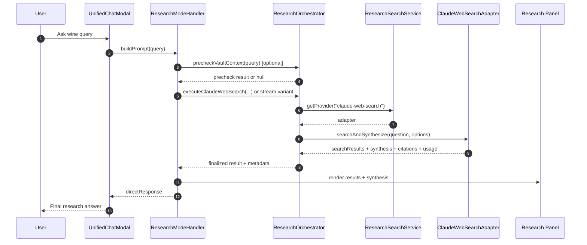
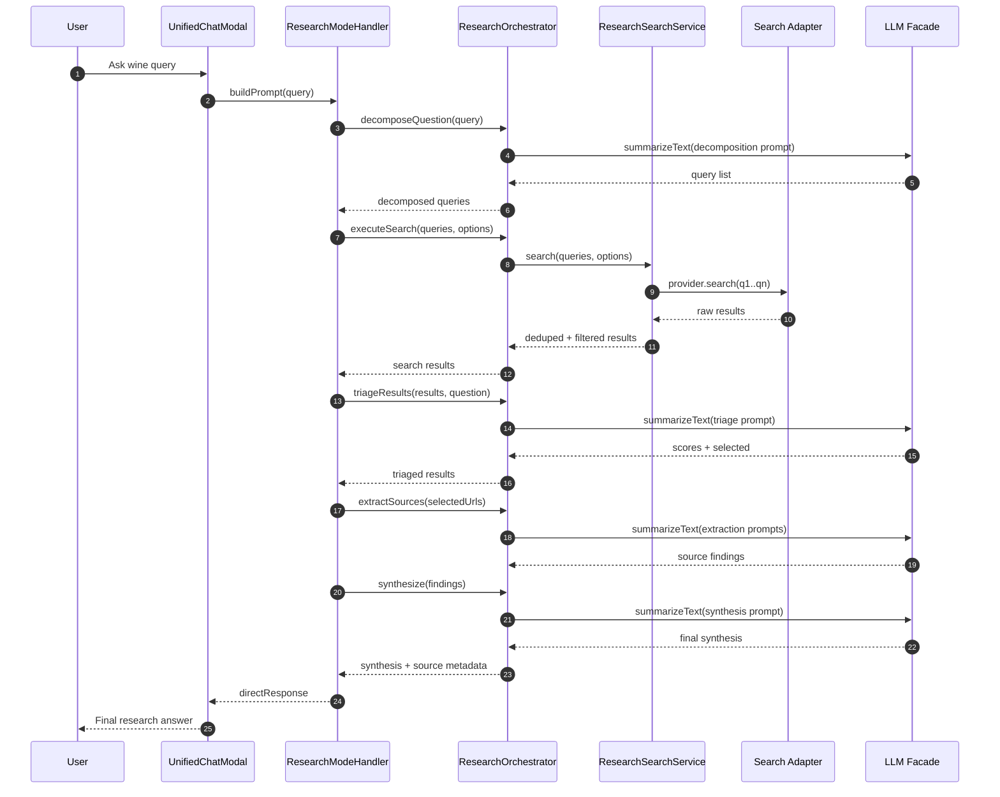

# Web Search Architecture Brief (Wine Query Example)

## Goal
This document explains how our web search stack produced a rich, multi-section answer for:

`Markovitis, Alkemi Rosé, Naoussa, Macedonia, Greece, 2023`

The result included structured sections on the producer, grape variety, terroir, winemaking, tasting notes, food pairings, and critical reception — all generated from a single user query with zero wine-specific code. This brief walks through exactly how that happened and what the team should consider next.

## Query Walkthrough (What Happens Today)
1. User runs research from chat (`research-web` command), which opens a unified chat modal in `research` mode.
2. `ResearchModeHandler` selects a pipeline based on the configured `researchProvider` setting.
3. Two possible execution paths:
   - **Unified path** (`claude-web-search`): one API call to Claude with a `web_search` tool — Claude autonomously searches, reads pages, and writes a cited synthesis. **This is the path that produced the wine result.**
   - **Staged path** (`tavily` or `brightdata-serp`): multi-step pipeline — decompose query → search → LLM triage → fetch & extract → LLM synthesis. Uses 4+ separate LLM calls.
4. Results are shown in the research panel. The user can insert at cursor, add as new section, save to a pending note, or export to Zotero.

## Core Design
### 1) UI and Command Layer
- Entry command: `src/commands/researchCommands.ts`
- Modal shell: `src/ui/modals/UnifiedChatModal.ts`
- Research mode controller: `src/ui/chat/ResearchModeHandler.ts`

The handler is UI-focused and delegates business logic to `ResearchOrchestrator`.

### 2) Orchestrator Layer
- File: `src/services/research/researchOrchestrator.ts`

Responsibilities:
- Query decomposition (staged path)
- Search execution via provider service
- LLM triage and extraction
- Final synthesis
- Citation verification (staged synthesis)
- Vault pre-check (RAG advisory)
- Session save/resume for ongoing research work

### 3) Search Provider Layer
- File: `src/services/research/researchSearchService.ts`

Provider registry in this layer:
- `tavily`
- `brightdata-serp`
- `claude-web-search`

What it adds:
- Multi-query parallel search
- URL normalization dedup
- Excluded-site filtering
- Fallback to another configured provider when primary returns zero results

### 4) Provider Adapters
- Tavily: `src/services/research/adapters/tavilyAdapter.ts`
- Bright Data SERP: `src/services/research/adapters/brightdataSerpAdapter.ts`
- Claude Web Search: `src/services/research/adapters/claudeWebSearchAdapter.ts`

Notable behavior:
- Tavily can include `raw_content`, which reduces extra fetches later.
- Bright Data maps recency to Google `tbs` query options.
- Claude Web Search supports:
  - single-call search+synthesis
  - SSE streaming
  - pause/continue handling
  - citation extraction and citation-frequency scoring

### 5) Prompt Layer
- File: `src/services/prompts/researchPrompts.ts`

Structured XML prompts for:
- query decomposition
- result triage
- source extraction
- contextual answer checks
- final synthesis

Includes output format constraints (JSON where needed) and prompt-injection guardrails in source extraction.

### 6) LLM Service Layer
- Facade: `src/services/llmFacade.ts`
- Cloud: `src/services/cloudService.ts`
- Local: `src/services/localService.ts`
- Global provider defaults: `src/services/adapters/providerRegistry.ts`

This layer standardizes `summarizeText` and optional streaming behavior across providers.

### 7) Quality, Cost, and Utility Layers
- Usage guardrails: `src/services/research/researchUsageService.ts`
- Source quality scoring: `src/services/research/sourceQualityService.ts`
- Academic enrichment: `src/services/research/academicUtils.ts`
- URL normalize/classify helpers: `src/utils/urlUtils.ts`

## Sequence Diagram: Unified Claude Web Search Path


## Sequence Diagram: Staged Provider Path (Tavily/Bright Data)


## Concrete Step-by-Step: What Happened for the Wine Query

Here is exactly what the system did when the user typed `Markovitis, Alkemi Rosé, Naoussa, Macedonia, Greece, 2023`:

| Step | Component | What happened |
|------|-----------|---------------|
| 1 | `UnifiedChatModal` | User submits query; modal calls `ResearchModeHandler.buildPrompt()` |
| 2 | `ResearchModeHandler` | Privacy consent check (one-time gate for cloud API usage) |
| 3 | `ResearchModeHandler` | Optional vault pre-check via RAG — looks for existing notes about this wine. If found, offers to use vault context instead of searching. |
| 4 | `ResearchModeHandler` | Provider is `claude-web-search` → calls `executeClaudeWebSearchCycle()` |
| 5 | `ResearchOrchestrator` | Budget check via `researchUsageService` (under monthly limit?) |
| 6 | `ClaudeWebSearchAdapter` | Builds a **single API request**: system prompt + `web_search` tool (max 5 searches) + user message |
| 7 | Claude API | Claude autonomously runs ~3-5 web searches, reads the pages, and writes a structured synthesis with inline `[1][2]` citations |
| 8 | `ClaudeWebSearchAdapter` | Parses response: extracts `SearchResult[]` from tool-result blocks, strips pre-search preamble, extracts citations, assigns citation-frequency scores |
| 9 | `ResearchOrchestrator` | Finalization: records API cost, runs `SourceQualityService.scoreResults()`, builds `SourceMetadata` map, deduplicates citations |
| 10 | `ResearchModeHandler` | Renders results panel (source cards with quality badges) + synthesis markdown |
| 11 | User | Reads the answer; can insert into note, ask a follow-up, or export |

**Key insight:** Steps 6-8 are a single HTTP round-trip. Claude handles query decomposition, page fetching, and synthesis internally. This is why the unified path is faster and cheaper than the staged path (which makes 4+ separate LLM calls).

---

## Why the Wine Result Is So Rich

There is **no wine-specific code anywhere in the system**. The richness comes entirely from five general-purpose mechanisms working together.

### 1) Claude decides what to search (autonomous multi-query)

When the user submits `Markovitis, Alkemi Rosé, Naoussa, Macedonia, Greece, 2023`, the system sends a single API call to Claude with a `web_search` tool and a budget of up to 5 searches. Claude autonomously decides which queries to run — likely something like:

- `Markovitis winery Naoussa Greece`
- `Alkemi Rosé Xinomavro 2023 tasting notes`
- `Naoussa PDO Macedonia wine region`

This means the model itself decomposes the query based on its world knowledge, targeting different facets (producer, wine, terroir) without any explicit decomposition prompt.

### 2) System prompt demands structure

The system prompt sent to Claude says:

```
You are a thorough research assistant. Search the web to answer the user's
question comprehensively. Provide a well-structured answer with clear sections.
Use numbered [1], [2] citation style. Always cite your sources inline.
Respond in English.
```

"Well-structured answer with clear sections" is what drives Claude to produce the `## Producer`, `## Grape`, `## Terroir`, `## Winemaking`, `## Tasting Notes` structure. Claude receives no template — it infers the logical sections from the domain.

### 3) Preamble filtering removes noise

Claude's raw response typically starts with filler like "I'll search for information about this wine...". The adapter strips this automatically:

1. Find the **last** `web_search_tool_result` block in the response.
2. Discard all text blocks **before** that index.
3. Only include text blocks **after** the final search completes.

This ensures the user sees only the synthesized answer, not Claude's internal monologue.

### 4) Citation-frequency scoring ranks sources by actual use

After parsing the response, the adapter counts how many times each URL was cited in the text. More citations = higher implicit quality score:

```
score = citationCount / maxCitationCount   (uncited results get 0.1)
```

This means sources that Claude found most useful float to the top of the results list — a signal of factual relevance without any domain-specific weighting.

### 5) Deterministic quality scoring adds a second quality layer

If quality scoring is enabled, the `SourceQualityService` overlays a second ranking using 5 weighted signals:

| Signal | Weight | What it measures |
|--------|--------|------------------|
| Relevance | 0.45 | LLM triage score (how relevant to the query) |
| Authority | 0.20 | Domain trust tier (e.g., `.edu` = 0.8, `reddit.com` = 0.4) |
| Freshness | 0.15 | Date decay (< 30 days = 1.0, < 1 year = 0.5, > 3 years = 0.0) |
| Depth | 0.10 | Content length (more content = higher score) |
| Diversity | 0.10 | Domain uniqueness (penalizes multiple results from same site) |

For the wine query, this would naturally favor wine-specific retailer and review sites that have deep product pages, over shallow aggregator snippets.

### 6) Post-processing and multi-turn follow-ups

The orchestrator runs a finalization pass:
- Records API usage for cost tracking.
- Deduplicates citations into a `SourceMetadata` map.
- Stores conversation history so the user can ask follow-up questions (e.g., "What food pairs best with this wine?") without re-searching.

### In short

The system produces rich output because:
1. **Claude autonomously searches** multiple angles of the query.
2. **The system prompt instructs** structured, sectioned, cited answers.
3. **Preamble filtering** strips filler, showing only the synthesis.
4. **Citation and quality scoring** rank sources by actual usefulness.
5. **No domain-specific logic** — the same pipeline works for wine, history, science, or any topic.

## What the Team Should Consider Next

### 1. Claim-to-citation grounding (accuracy)
The unified Claude path trusts Claude's inline citations, but doesn't independently verify that a claim is actually supported by the cited source. The staged path has a `verifyCitations()` pass that removes hallucinated `[N]` references. Consider adding similar post-hoc verification for the unified path.

### 2. Deterministic entity extraction (structured data)
Before or after narrative generation, extract structured wine entities into a JSON schema:
```json
{
  "producer": "Markovitis Winery",
  "wine_label": "Alkemi Rosé",
  "grape": ["Xinomavro"],
  "vintage": 2023,
  "region": "Naoussa",
  "country": "Greece",
  "appellation": "PDO Naoussa",
  "farming": "organic"
}
```
This enables programmatic use (search, filtering, comparison) independent of the prose answer.

### 3. Wine domain trust weighting
The current `SourceQualityService` has authority tiers for news and academic sites, but none for wine-specific domains. Consider adding tiers for:
- High trust (0.85+): wine-searcher.com, jancisrobinson.com, decanter.com, vinous.com
- Medium trust (0.65+): vivino.com, cellartracker.com, wine-folly.com
- Low trust (0.4): generic retailers, affiliate blogs

### 4. Output schema mode (`json + prose`)
Return both a structured JSON object (entities, scores, metadata) and the prose answer. This allows the wine app UI to render cards, filters, and comparisons from the JSON, while showing the full narrative when the user wants depth.

### 5. Regression test set
Build a set of 20-30 wine queries (covering different regions, grape varieties, and obscurity levels) and track per query:
- **Factual accuracy**: Are producer, grape, region, vintage correct?
- **Citation coverage**: Does every factual claim have a source?
- **Latency**: Time from query to final answer
- **Cost**: API spend per response
- **Hallucination rate**: Claims not supported by any cited source

## Copied Files for Team Review

All relevant source files are copied under `docs/sert/relevant-files/` — see [FILE-INDEX.md](FILE-INDEX.md) for the full list.

**Source files** (in `relevant-files/src/`):
- Command wiring, UI handler, orchestration, provider adapters, prompts, LLM services, and utilities.

**Test files** (in `relevant-files/tests/`):
- 138 Claude Web Search tests (adapter, integration, streaming)
- Orchestrator, search service, and usage service tests

To understand the wine result specifically, start with these files in order:
1. `claudeWebSearchAdapter.ts` — the single-call adapter that talks to Claude
2. `researchOrchestrator.ts` — the orchestration and finalization logic
3. `researchPrompts.ts` — the synthesis prompt that drives structured output
4. `sourceQualityService.ts` — the deterministic quality scoring layer
5. `ResearchModeHandler.ts` — the UI state machine and rendering
